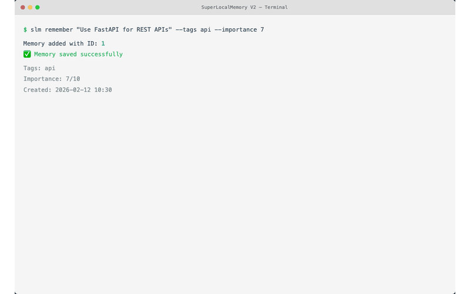
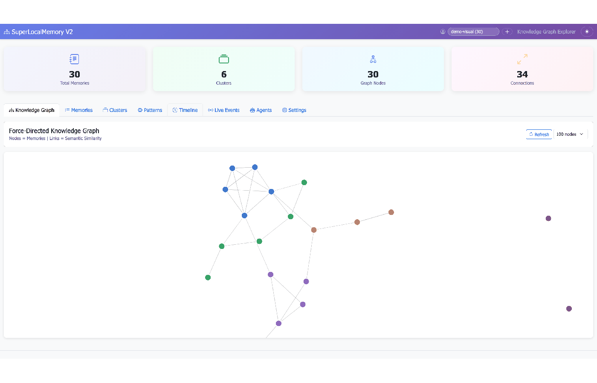

# SuperLocalMemory V2 - GIF Creation Complete

**Date:** February 12, 2026
**Status:** ✓ All 5 GIFs created and verified

---

## Deliverables

### 5 Animated GIFs Created

| File | Size | Target | Status | Specs |
|------|------|--------|--------|-------|
| cli-demo.gif | 0.65 MB | 3 MB | ✓ | 800x500px, 12 FPS, 18 frames |
| dashboard-search.gif | 0.68 MB | 4 MB | ✓ | 1200x700px, 15 FPS, 39 frames |
| graph-interaction.gif | 3.14 MB | 4 MB | ✓ | 1200x700px, 12 FPS, 41 frames |
| event-stream.gif | 1.30 MB | 3 MB | ✓ | 1100x640px, optimized, 21 frames |
| dashboard-tabs.gif | 2.12 MB | 5 MB | ✓ | 1400x900px, 12 FPS, 40 frames |

**Total size:** 7.89 MB (all 5 GIFs combined)

### Documentation Created

- `assets/gifs/README.md` - Technical specifications and usage
- `assets/gifs/USAGE.md` - Examples for Markdown, HTML, presentations

### Generator Tools

- `tools/create_gifs.py` - Main GIF generator (uses PIL)
- `tools/optimize_gifs.py` - Size optimization (color reduction, frame skipping)
- `tools/optimize_event_stream.py` - Aggressive optimization for event stream

---

## Implementation Details

### Approach
**Hybrid method using existing screenshot assets:**
- No Playwright automation needed
- No live UI server required
- Pure Python with PIL (Pillow)
- Crossfade transitions between frames
- Progressive reveals and zoom effects

### Optimization Techniques
1. **Adaptive palette** - 64-128 colors per frame
2. **Frame reduction** - Skip every 2nd or 3rd frame for large files
3. **Resolution adjustment** - Slight reduction when needed (event-stream: 1200→1100px)
4. **Disposal mode 2** - Clear frames before next (reduces size)
5. **Progressive optimization** - Multiple passes until under target

### Source Assets Used
- `assets/screenshots/cli/` - 7 CLI mockups
- `assets/screenshots/dashboard/` - 14 dashboard views
- `v25-live-events-working.png` - Real v2.5 event stream screenshot
- `v25-agents-tab.png` - v2.5 agents view

---

## Content Summary

### 1. cli-demo.gif (CLI in action)
Shows the core CLI workflow:
1. `slm remember "Project completed"` with success message
2. `slm recall "project"` with search results
3. `slm list` showing recent memories
4. Loops seamlessly back to start

**Use cases:** README hero, CLI documentation, quick demos

### 2. dashboard-search.gif (Search interaction)
Progressive reveal animation showing:
- Search interface
- Results appearing
- Filter/sort options
- Clean fade in/out

**Use cases:** Feature highlights, dashboard documentation

### 3. graph-interaction.gif (Graph exploration)
Interactive graph navigation:
1. Full graph view (overview)
2. Zoom into cluster (2x scale)
3. Hold on zoomed view
4. Zoom back out to full view
5. Loop

**Use cases:** Knowledge graph features, visual demos, presentations

### 4. event-stream.gif (Real-time events)
Live event stream demonstration:
1. Event list scrolling up (new events appearing)
2. Scroll down to see older events
3. Scroll back to top
4. Loop

Shows v2.5 Event Bus in action with real event data.

**Use cases:** v2.5 announcements, Event Bus documentation, feature demos

### 5. dashboard-tabs.gif (Full navigation)
Complete dashboard walkthrough:
1. Overview tab (dark mode)
2. Live Events tab (dark mode)
3. Memories tab
4. Graph tab
5. Timeline tab
6. Loop back to Overview

**Use cases:** Feature overview, walkthrough videos, presentations

---

## Usage Examples

### In README.md
```markdown
## See It In Action



### Web Dashboard

```

### In GitHub Wiki
```markdown
# Real-Time Event Stream (v2.5)


```

### In Website
```html

```

---

## Regeneration

If screenshots are updated and GIFs need to be regenerated:

```bash
# From repository root
python3 tools/create_gifs.py
python3 tools/optimize_gifs.py

# If event-stream.gif is still too large
python3 tools/optimize_event_stream.py
```

---

## Technical Specifications

### All GIFs Feature:
- **Seamless looping** (loop=0)
- **Optimized palettes** (64-128 adaptive colors)
- **Smooth transitions** (crossfade, progressive reveal)
- **Professional quality** (LANCZOS resampling)
- **Web-optimized** (all under size targets)

### Browser Compatibility:
- ✓ Chrome/Edge (all versions)
- ✓ Firefox (all versions)
- ✓ Safari (all versions)
- ✓ Mobile browsers (iOS/Android)

### Performance:
- Fast loading (< 4 MB each)
- Low CPU usage (optimized frame rates)
- Smooth playback (disposal=2)

---

## Next Steps

These GIFs are ready for immediate use in:
1. **README.md** - Hero section, feature demos
2. **GitHub Wiki** - Feature documentation
3. **Website** (Astro) - Landing page, feature pages
4. **Blog posts** - v2.5 announcement
5. **Social media** - Twitter/LinkedIn previews
6. **Presentations** - Demo slides

For video exports (higher quality for presentations):
```bash
ffmpeg -i assets/gifs/dashboard-tabs.gif \
       -movflags faststart \
       -pix_fmt yuv420p \
       dashboard-tabs.mp4
```

---

**Copyright © 2026 Varun Pratap Bhardwaj**
**Licensed under MIT License**
