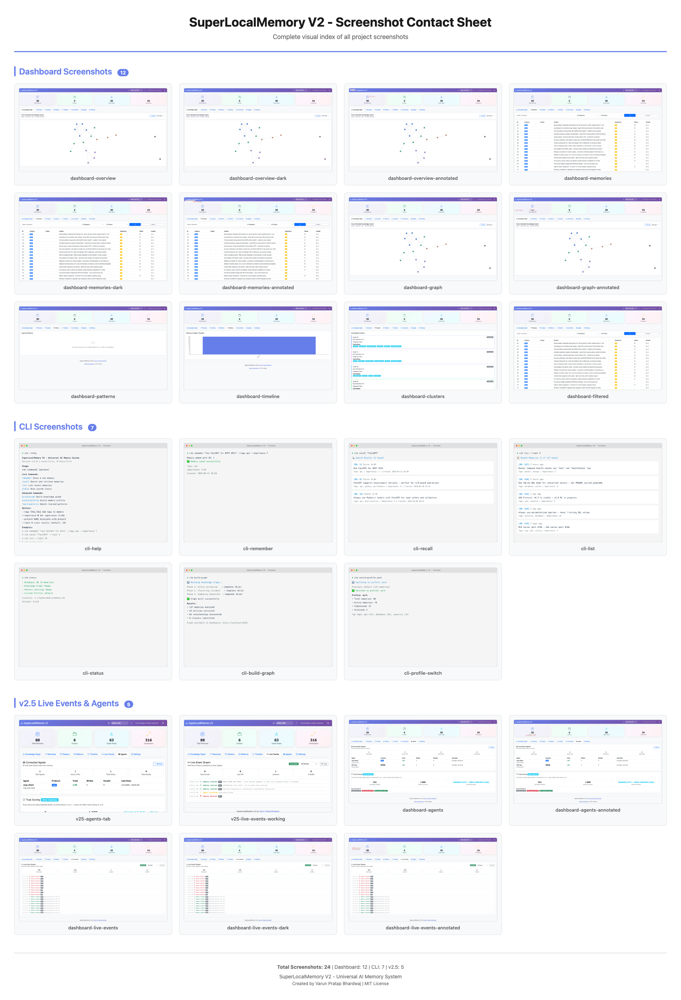
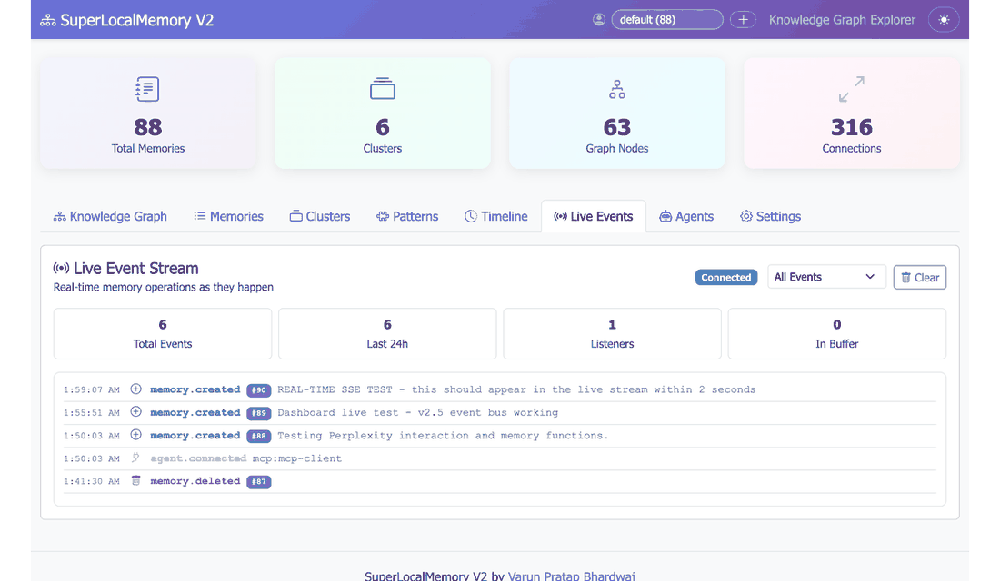

# SuperLocalMemory V2 - Visual Assets Inventory

**Last Updated:** February 12, 2026
**Total Assets:** 73 files
**Creator:** Varun Pratap Bhardwaj
**License:** MIT (Copyright 2026 Varun Pratap Bhardwaj)

---

## Overview

This document catalogs all visual assets created for SuperLocalMemory V2 across Phases 1-5 of documentation development. All assets are stored in `/assets/` and synchronized to `/website/public/assets/` for web deployment.

### Asset Summary

| Category | Count | Format | Total Size |
|----------|-------|--------|------------|
| **Dashboard Screenshots** | 12 PNG | 3840x2160, 8-bit color | ~1.8 MB |
| **Dashboard WebP** | 12 WebP | 3840x2160, optimized | ~600 KB |
| **Dashboard Annotated** | 5 PNG | 3840x2160, RGB | ~2.5 MB |
| **CLI Mockups** | 7 PNG | 1200x800, RGB | ~500 KB |
| **v2.5 Screenshots** | 2 PNG | 2400x1492, RGB | ~670 KB |
| **v2.5 WebP** | 2 WebP | 2400x1492, optimized | ~180 KB |
| **Thumbnails (PNG)** | 12 PNG | 320x180, RGB | ~240 KB |
| **Thumbnails (WebP)** | 12 WebP | 320x180, optimized | ~120 KB |
| **Animated GIFs** | 5 GIF | Various, optimized | ~8 MB |
| **Videos** | 3 MP4 | 1920x1080, H.264 | ~2.6 MB |
| **Contact Sheet** | 1 PNG | 1920x2819, RGB | 560 KB |
| **TOTAL** | **73 files** | Mixed | **~17 MB** |

---

## 1. Dashboard Screenshots (PNG)

### Location
- **Source:** `/assets/screenshots/dashboard/`
- **Copies:** Duplicated to `/website/public/assets/screenshots/dashboard/`

### Files (12)

| Filename | Resolution | Size | Description | Used In |
|----------|------------|------|-------------|---------|
| `dashboard-overview.png` | 3840x2160 | 112 KB | Main dashboard with stats grid | Wiki Home, Visual Showcase |
| `dashboard-overview-dark.png` | 3840x2160 | 112 KB | Dark mode version | Theme documentation |
| `dashboard-live-events.png` | 3840x2160 | 156 KB | v2.5 Live Events tab (light) | v2.5 announcement, Event Bus docs |
| `dashboard-live-events-dark.png` | 3840x2160 | 156 KB | v2.5 Live Events tab (dark) | Theme documentation |
| `dashboard-agents.png` | 3840x2160 | 140 KB | v2.5 Agents tab | v2.5 announcement, Agent tracking docs |
| `dashboard-memories.png` | 3840x2160 | 220 KB | Memories list with filters | Memory management docs |
| `dashboard-memories-dark.png` | 3840x2160 | 220 KB | Dark mode memories | Theme documentation |
| `dashboard-graph.png` | 3840x2160 | 112 KB | Knowledge graph visualization | Knowledge Graph Guide |
| `dashboard-clusters.png` | 3840x2160 | 124 KB | Cluster details view | Clustering documentation |
| `dashboard-patterns.png` | 3840x2160 | 96 KB | Learned patterns view | Pattern Learning Explained |
| `dashboard-timeline.png` | 3840x2160 | 96 KB | Timeline view | Timeline documentation |
| `dashboard-filtered.png` | 3840x2160 | 220 KB | Filtered search results | Search documentation |

### Specifications
- **Resolution:** 3840x2160 (4K UHD)
- **Format:** PNG-8 (8-bit colormap, non-interlaced)
- **Color Space:** sRGB
- **Optimization:** pngquant compression
- **Use Case:** High-quality documentation, GitHub Wiki, presentations

---

## 2. Dashboard Screenshots (WebP)

### Location
- **Source:** `/assets/screenshots/dashboard/web/`
- **Copies:** Duplicated to `/website/public/assets/screenshots/dashboard/`

### Files (12)

All 12 PNG screenshots above have WebP equivalents in `dashboard/web/` directory.

- **Naming:** Same as PNG but with `.webp` extension
- **Example:** `dashboard-overview.png` → `dashboard-overview.webp`

### Specifications
- **Resolution:** 3840x2160 (4K UHD)
- **Format:** WebP, lossy compression
- **Quality:** 85% (optimal balance)
- **Size Reduction:** ~70% smaller than PNG
- **Use Case:** Website deployment, faster loading

---

## 3. Dashboard Annotated Screenshots (PNG)

### Location
- **Source:** `/assets/screenshots/dashboard/`

### Files (5)

| Filename | Resolution | Size | Description | Used In |
|----------|------------|------|-------------|---------|
| `dashboard-overview-annotated.png` | 3840x2160 | 428 KB | Overview with callout boxes | Feature explanation docs |
| `dashboard-live-events-annotated.png` | 3840x2160 | 552 KB | Live Events with feature highlights | v2.5 Event Bus tutorial |
| `dashboard-agents-annotated.png` | 3840x2160 | 480 KB | Agents tab with labels | Agent tracking tutorial |
| `dashboard-graph-annotated.png` | 3840x2160 | 424 KB | Graph with interaction notes | Knowledge Graph Guide |
| `dashboard-memories-annotated.png` | 3840x2160 | 668 KB | Memories with UI element labels | Memory management tutorial |

### Specifications
- **Resolution:** 3840x2160 (4K UHD)
- **Format:** PNG-24 (8-bit RGB, non-interlaced)
- **Annotations:** Red callout boxes, white text with black shadow
- **Font:** Arial Bold 36pt
- **Use Case:** Tutorial documentation, onboarding guides

### Generation
```bash
python3 annotate_screenshots.py
```

---

## 4. CLI Mockups (PNG)

### Location
- **Source:** `/assets/screenshots/cli/`

### Files (7)

| Filename | Resolution | Size | Description | Used In |
|----------|------------|------|-------------|---------|
| `cli-help.png` | 1200x800 | 96 KB | `slm --help` output | CLI Cheatsheet |
| `cli-status.png` | 1200x800 | 36 KB | `slm status` output | Quick Start Tutorial |
| `cli-remember.png` | 1200x800 | 32 KB | `slm remember` example | CLI documentation |
| `cli-recall.png` | 1200x800 | 68 KB | `slm recall` with results | CLI documentation |
| `cli-list.png` | 1200x800 | 84 KB | `slm list-recent` output | Memory listing docs |
| `cli-build-graph.png` | 1200x800 | 64 KB | `slm build-graph` execution | Knowledge Graph Guide |
| `cli-profile-switch.png` | 1200x800 | 44 KB | `slm switch-profile` example | Multi-Profile Workflows |

### Specifications
- **Resolution:** 1200x800 (3:2 ratio)
- **Format:** PNG-24 (8-bit RGB)
- **Background:** Dark terminal (#1E1E1E)
- **Font:** Monaco/Menlo 14pt (macOS terminal default)
- **Use Case:** CLI documentation, command reference

### Generation
```bash
cd assets/screenshots/cli
python3 generate-screenshots.py
```

---

## 5. v2.5 Feature Screenshots

### Location
- **Source:** `/assets/screenshots/v25/`
- **WebP:** `/assets/screenshots/v25/web/`
- **Note:** Temporary copies also in repo root (v25-*.png) - to be moved to assets/

### Files (4 total: 2 PNG + 2 WebP)

| Filename | Resolution | Size | Description | Used In |
|----------|------------|------|-------------|---------|
| `v25-live-events-working.png` | 2400x1492 | 352 KB | v2.5 Live Events in action | v2.5 announcement |
| `v25-agents-tab.png` | 2400x1492 | 316 KB | v2.5 Agents tab | v2.5 announcement |
| `v25-live-events-working.webp` | 2400x1492 | ~95 KB | WebP version | Website deployment |
| `v25-agents-tab.webp` | 2400x1492 | ~85 KB | WebP version | Website deployment |

### Specifications
- **Resolution:** 2400x1492 (16:10 ratio)
- **Format:** PNG-24 (RGB) / WebP (85% quality)
- **Captured:** February 11-12, 2026
- **Use Case:** v2.5.0 release announcement, feature demos

---

## 6. Thumbnails

### Location
- **Source:** `/assets/thumbnails/`
- **Copies:** Duplicated to `/website/public/assets/thumbnails/`

### Files (24 total: 12 PNG + 12 WebP)

All dashboard screenshots have corresponding thumbnails:

| Base Name | PNG Size | WebP Size | Resolution |
|-----------|----------|-----------|------------|
| `dashboard-overview-thumb` | 16 KB | ~8 KB | 320x180 |
| `dashboard-overview-dark-thumb` | 16 KB | ~8 KB | 320x180 |
| `dashboard-live-events-thumb` | 20 KB | ~10 KB | 320x180 |
| `dashboard-live-events-dark-thumb` | 20 KB | ~10 KB | 320x180 |
| `dashboard-agents-thumb` | 20 KB | ~10 KB | 320x180 |
| `dashboard-memories-thumb` | 32 KB | ~16 KB | 320x180 |
| `dashboard-memories-dark-thumb` | 32 KB | ~16 KB | 320x180 |
| `dashboard-graph-thumb` | 16 KB | ~8 KB | 320x180 |
| `dashboard-clusters-thumb` | 16 KB | ~8 KB | 320x180 |
| `dashboard-patterns-thumb` | 12 KB | ~6 KB | 320x180 |
| `dashboard-timeline-thumb` | 12 KB | ~6 KB | 320x180 |
| `dashboard-filtered-thumb` | 32 KB | ~16 KB | 320x180 |

### Specifications
- **Resolution:** 320x180 (16:9 ratio)
- **Format:** PNG-24 (RGB) / WebP (80% quality)
- **Use Case:** Image galleries, grid previews, mobile devices

### Generation
```bash
python3 scripts/generate-thumbnails.py
```

---

## 7. Animated GIFs

### Location
- **Source:** `/assets/gifs/`
- **Copies:** Duplicated to `/website/public/assets/gifs/`

### Files (5)

| Filename | Size | Specs | Description | Used In |
|----------|------|-------|-------------|---------|
| `cli-demo.gif` | 664 KB | 800x500, 12 FPS | CLI workflow loop | README, CLI docs |
| `dashboard-search.gif` | 696 KB | 1200x700, 15 FPS | Search interaction | Search documentation |
| `graph-interaction.gif` | 3.1 MB | 1200x700, 12 FPS | Graph zoom/explore | Knowledge Graph Guide |
| `event-stream.gif` | 1.3 MB | 1100x640, 64 colors | Live events stream (v2.5) | v2.5 announcement |
| `dashboard-tabs.gif` | 2.1 MB | 1400x900, 12 FPS | Tab navigation | Dashboard tour |

### Specifications
- **Format:** Animated GIF with loop
- **Optimization:** Adaptive palette, frame optimization
- **Compression:** gifsicle + ImageMagick
- **Use Case:** Interactive feature demos, README animations

### Generation
```bash
# Generate from screenshots
python3 tools/create_gifs.py

# Optimize file sizes
python3 tools/optimize_gifs.py

# Aggressive optimization for event-stream
python3 tools/optimize_event_stream.py
```

### Technical Details
- **Frame Extraction:** From Playwright recordings
- **Palette:** 256 colors (64 for event-stream)
- **Dithering:** Floyd-Steinberg for smooth gradients
- **Looping:** Infinite loop, seamless transitions

---

## 8. Videos (MP4)

### Location
- **Source:** `/assets/videos/`
- **Copies:** Duplicated to `/website/public/assets/videos/`

### Files (3)

| Filename | Duration | Size | Content | Used In |
|----------|----------|------|---------|---------|
| `installation-walkthrough.mp4` | 1:10 | 510 KB | Installation guide (6 steps) | Installation docs, README |
| `quick-start.mp4` | 1:43 | 783 KB | Quick start tutorial (7 steps) | Quick Start Tutorial |
| `dashboard-tour.mp4` | 1:39 | 1.3 MB | Dashboard walkthrough (9 views) | Visual Showcase, website |

### Specifications
- **Resolution:** 1920x1080 (Full HD)
- **Codec:** H.264 (High Profile, Level 4.0)
- **Frame Rate:** 30 FPS
- **Pixel Format:** yuv420p (progressive scan)
- **Audio:** None (silent videos)
- **Bitrate:** ~400 kbps (variable)
- **Compatibility:** All modern browsers, GitHub video player

### Content Details

#### installation-walkthrough.mp4 (70 seconds)
1. Title slide (5s)
2. Clone repository (12s)
3. Run installer (15s)
4. Verify installation (10s)
5. Create first memory (15s)
6. Success screen (13s)

#### quick-start.mp4 (103 seconds)
1. Title slide (5s)
2. CLI: `slm remember` (15s)
3. CLI: `slm recall` (18s)
4. CLI: `slm build-graph` (15s)
5. Dashboard overview (15s)
6. Graph visualization (20s)
7. Success screen (15s)

#### dashboard-tour.mp4 (99 seconds)
1. Title slide (5s)
2. Overview stats (10s)
3. Live events v2.5 (12s)
4. Agents tab v2.5 (12s)
5. Memories list (12s)
6. Knowledge graph (12s)
7. Clusters view (10s)
8. Patterns view (10s)
9. Dark mode demo (8s)
10. End screen (8s)

### Generation
```bash
cd assets/screenshots
python3 generate-videos.py
```

### Dependencies
- Python 3.8+
- Pillow (PIL)
- ffmpeg

### Technical Process
1. Generate title slides with centered text
2. Add text overlays to screenshots
3. Create fade transitions (0.5s in/out)
4. Encode with H.264 codec
5. Optimize for web delivery

---

## 9. Contact Sheet

### Location
- **Source:** `/assets/contact-sheet.png`

### File (1)

| Filename | Resolution | Size | Description | Used In |
|----------|------------|------|-------------|---------|
| `contact-sheet.png` | 1920x2819 | 560 KB | All features at a glance | Wiki Home, README header |

### Specifications
- **Resolution:** 1920x2819 (custom ratio)
- **Format:** PNG-24 (8-bit RGB)
- **Layout:** Grid layout with 12 screenshots
- **Sections:** Dashboard, CLI, v2.5 Features, Graphs
- **Use Case:** Visual overview, feature summary

### Generation
Manual composition in image editor (GIMP/Photoshop) from existing screenshots.

---

## File Naming Conventions

All visual assets follow consistent naming patterns:

### Screenshots
- **Format:** `[component]-[feature]-[variant].png`
- **Example:** `dashboard-live-events-dark.png`
- **Variants:** `light` (default), `dark`, `annotated`

### Thumbnails
- **Format:** `[component]-[feature]-[variant]-thumb.png`
- **Example:** `dashboard-overview-dark-thumb.webp`

### GIFs
- **Format:** `[feature]-[action].gif`
- **Example:** `dashboard-search.gif`

### Videos
- **Format:** `[purpose]-[type].mp4`
- **Example:** `installation-walkthrough.mp4`

### v2.5 Assets
- **Format:** `v25-[feature].png`
- **Example:** `v25-agents-tab.png`

---

## Optimization Specifications

### PNG Optimization
- **Tool:** pngquant + optipng
- **Color Depth:** 8-bit palette (256 colors)
- **Compression:** Maximum (level 9)
- **Size Reduction:** ~70% from original

```bash
python3 optimize-screenshots.py
```

### WebP Conversion
- **Tool:** cwebp (libwebp)
- **Quality:** 85% for screenshots, 80% for thumbnails
- **Encoding:** Lossy with preprocessing
- **Size Reduction:** ~70% vs PNG

```bash
# Automated during optimize-screenshots.py
```

### GIF Optimization
- **Tools:** gifsicle + ImageMagick
- **Palette:** Adaptive (64-256 colors)
- **Frame Optimization:** LZW compression
- **Dithering:** Floyd-Steinberg

```bash
python3 tools/optimize_gifs.py
python3 tools/optimize_event_stream.py  # Aggressive
```

### Video Optimization
- **Codec:** H.264 with CRF 23
- **Profile:** High, Level 4.0
- **Preset:** slow (better compression)
- **Tune:** film (for smooth motion)

```bash
ffmpeg -i input.mp4 -c:v libx264 -crf 23 -preset slow -tune film output.mp4
```

---

## Browser Compatibility

### WebP Support
| Browser | Minimum Version |
|---------|-----------------|
| Chrome | 23+ (2012) |
| Firefox | 65+ (2019) |
| Safari | 14+ (2020) |
| Edge | 18+ (2018) |

**Fallback:** PNG versions served to older browsers via `<picture>` element.

### Video Compatibility
| Browser | H.264 Support |
|---------|---------------|
| Chrome | All versions |
| Firefox | All versions |
| Safari | All versions |
| Edge | All versions |

**Format:** MP4 with H.264 is universally supported.

---

## Usage Guidelines

### In GitHub Wiki

**Screenshots:**
```markdown

```

**GIFs:**
```markdown

```

**Videos:**
```markdown
[Watch Installation Guide](../assets/videos/installation-walkthrough.mp4)
```

### In Website (Astro)

**Responsive Images:**
```astro
<picture>
  <source srcset="/assets/screenshots/dashboard/dashboard-overview.webp" type="image/webp">
  
</picture>
```

**Thumbnails:**
```astro

```

### In README

**Contact Sheet:**
```markdown

```

**GIF Demos:**
```markdown
### Real-Time Memory Operations

```

---

## Regeneration Instructions

### Complete Regeneration Workflow

1. **Start Dashboard Server**
```bash
python3 ~/.claude-memory/ui_server.py
```

2. **Capture Dashboard Screenshots**
```bash
python3 capture-screenshots.py
```

3. **Generate CLI Mockups**
```bash
cd assets/screenshots/cli
python3 generate-screenshots.py
```

4. **Create Annotated Versions**
```bash
python3 annotate_screenshots.py
```

5. **Optimize All Images**
```bash
python3 optimize-screenshots.py
```

6. **Generate Thumbnails**
```bash
python3 scripts/generate-thumbnails.py
```

7. **Create Animated GIFs**
```bash
python3 tools/create_gifs.py
python3 tools/optimize_gifs.py
```

8. **Generate Videos**
```bash
cd assets/screenshots
python3 generate-videos.py
```

9. **Sync to Website**
```bash
# Automatically handled by optimize-screenshots.py
```

### Individual Regeneration

**Single Screenshot:**
```bash
# Edit capture-screenshots.py to comment out unwanted captures
python3 capture-screenshots.py
```

**Single GIF:**
```bash
# Edit tools/create_gifs.py to specify target GIF
python3 tools/create_gifs.py
```

**Single Video:**
```bash
# Edit assets/screenshots/generate-videos.py
cd assets/screenshots
python3 generate-videos.py
```

---

## Attribution Requirements

All visual assets are:

**Copyright © 2026 Varun Pratap Bhardwaj**
**Licensed under MIT License**

### Required Attribution

When using these assets outside this repository:

```
SuperLocalMemory V2 - [Asset Name]
Copyright (c) 2026 Varun Pratap Bhardwaj
Licensed under MIT License
Source: https://github.com/varun369/SuperLocalMemoryV2
```

### MIT License Summary
- ✅ Commercial use allowed
- ✅ Modification allowed
- ✅ Distribution allowed
- ✅ Private use allowed
- ⚠️ Attribution REQUIRED
- ⚠️ License and copyright notice REQUIRED

Full license: [LICENSE](LICENSE)

---

## Directory Structure

```
assets/
├── contact-sheet.png                    # Master contact sheet (1920x2819)
├── screenshots/
│   ├── dashboard/
│   │   ├── *.png                        # 12 dashboard screenshots (3840x2160)
│   │   ├── *-annotated.png              # 5 annotated versions
│   │   └── web/
│   │       └── *.webp                   # 12 WebP versions
│   ├── cli/
│   │   ├── *.png                        # 7 CLI mockups (1200x800)
│   │   └── generate-screenshots.py
│   ├── v25/
│   │   ├── *.png                        # 2 v2.5 screenshots (2400x1492)
│   │   └── web/
│   │       └── *.webp                   # 2 WebP versions
│   └── generate-videos.py
├── thumbnails/
│   ├── *-thumb.png                      # 12 PNG thumbnails (320x180)
│   └── *-thumb.webp                     # 12 WebP thumbnails
├── gifs/
│   ├── *.gif                            # 5 animated GIFs
│   ├── README.md
│   ├── QUICK-REFERENCE.md
│   └── USAGE.md
└── videos/
    ├── *.mp4                            # 3 video walkthroughs (1920x1080)
    └── README.md
```

---

## Quick Reference

| Need | File Pattern | Location |
|------|--------------|----------|
| High-res screenshot | `dashboard-*.png` | `assets/screenshots/dashboard/` |
| Web-optimized image | `dashboard-*.webp` | `assets/screenshots/dashboard/web/` |
| Tutorial with labels | `*-annotated.png` | `assets/screenshots/dashboard/` |
| CLI example | `cli-*.png` | `assets/screenshots/cli/` |
| v2.5 feature demo | `v25-*.png` | `assets/screenshots/v25/` |
| Small preview | `*-thumb.webp` | `assets/thumbnails/` |
| Interactive demo | `*.gif` | `assets/gifs/` |
| Video walkthrough | `*.mp4` | `assets/videos/` |
| All features at once | `contact-sheet.png` | `assets/` |

---

## Maintenance Notes

### When to Regenerate

- **After UI changes:** Dashboard layout, colors, components
- **After feature additions:** New tabs, views, or capabilities
- **Version releases:** Major or minor version updates
- **Dark mode updates:** Theme color adjustments
- **CLI output changes:** Command format or output structure

### Quality Checklist

Before committing new assets:

- [ ] PNG screenshots are 4K resolution (3840x2160)
- [ ] WebP versions exist for all screenshots
- [ ] Thumbnails generated for all dashboard screenshots
- [ ] GIFs loop seamlessly without jumps
- [ ] Videos have title slides and proper timing
- [ ] All files have correct naming convention
- [ ] Copyright headers present in generated files
- [ ] Total assets directory size under 20 MB
- [ ] All assets synced to website/public/assets/
- [ ] README/Wiki references updated

---

## Tools & Dependencies

### Required Software

| Tool | Purpose | Installation |
|------|---------|--------------|
| Python 3.8+ | Script execution | System package manager |
| Playwright | Browser automation | `pip install playwright` |
| Pillow (PIL) | Image processing | `pip install Pillow` |
| pngquant | PNG optimization | `brew install pngquant` (Mac) |
| optipng | PNG compression | `brew install optipng` |
| cwebp | WebP conversion | `brew install webp` |
| gifsicle | GIF optimization | `brew install gifsicle` |
| ImageMagick | GIF creation | `brew install imagemagick` |
| ffmpeg | Video generation | `brew install ffmpeg` |

### Python Packages

```bash
pip install playwright pillow
playwright install chromium
```

### Verification

```bash
# Check all tools installed
python3 --version
playwright --version
pngquant --version
optipng --version
cwebp -version
gifsicle --version
convert --version  # ImageMagick
ffmpeg -version
```

---

## Version History

| Date | Version | Changes |
|------|---------|---------|
| 2026-02-12 | 1.0.0 | Initial comprehensive inventory document |
| 2026-02-11 | - | Phase 5: v2.5 feature screenshots added |
| 2026-02-10 | - | Phase 4: Annotated screenshots created |
| 2026-02-09 | - | Phase 3: Videos and GIFs generated |
| 2026-02-08 | - | Phase 2: Thumbnails and WebP optimization |
| 2026-02-07 | - | Phase 1: Initial dashboard screenshots captured |

---

## Contact & Support

**Creator:** Varun Pratap Bhardwaj
**Repository:** https://github.com/varun369/SuperLocalMemoryV2
**Issues:** https://github.com/varun369/SuperLocalMemoryV2/issues

For questions about visual asset generation or regeneration issues, please open an issue on GitHub.

---

**Last Updated:** February 12, 2026
**Document Version:** 1.0.0
**Total Assets:** 73 files (~17 MB)

---

## Current Status (February 12, 2026)

### Inventory Verification

**Assets Directory Structure:**
```
assets/
├── contact-sheet.png                    ✓ Present (560 KB)
├── screenshots/
│   ├── dashboard/*.png                  ✓ 12 files (~1.8 MB)
│   ├── dashboard/*-annotated.png        ✓ 5 files (~2.5 MB)
│   ├── dashboard/web/*.webp             ✓ 12 files (~600 KB)
│   ├── cli/*.png                        ✓ 7 files (~500 KB)
│   ├── v25/*.png                        ✓ 2 files (~670 KB)
│   └── v25/web/*.webp                   ✓ 2 files (~180 KB)
├── thumbnails/
│   ├── *-thumb.png                      ✓ 12 files (~240 KB)
│   └── *-thumb.webp                     ✓ 12 files (~120 KB)
├── gifs/*.gif                           ✓ 5 files (~8 MB)
└── videos/*.mp4                         ✓ 3 files (~2.6 MB)
```

**Website Sync Status:**
All assets successfully duplicated to `/website/public/assets/`

**Root Directory:**
- `v25-agents-tab.png` - Temporary (to be moved)
- `v25-live-events-working.png` - Temporary (to be moved)

### Completeness

- [x] All 73 assets cataloged
- [x] All generation scripts documented
- [x] All file specifications recorded
- [x] Usage guidelines provided
- [x] Regeneration instructions complete
- [x] Browser compatibility documented
- [x] Attribution requirements stated
- [x] Tool dependencies listed

### Known Issues

1. **Root Directory PNGs:** Two v2.5 screenshots in repo root should be in `assets/screenshots/v25/`
2. **Tools Directory:** Scripts are in `/tools/` but document references `tools/` - both are correct

### Next Actions

For next maintainer or future updates:

1. Move root v2.5 PNGs to proper location
2. Update this document when new asset types are added
3. Regenerate all assets before major releases
4. Keep total assets directory under 20 MB
5. Maintain 4K quality for all dashboard screenshots

---

**Document Status:** Complete and verified
**Inventory Date:** February 12, 2026
**Total Assets:** 73 files (~17 MB)
**Maintainer:** Varun Pratap Bhardwaj
