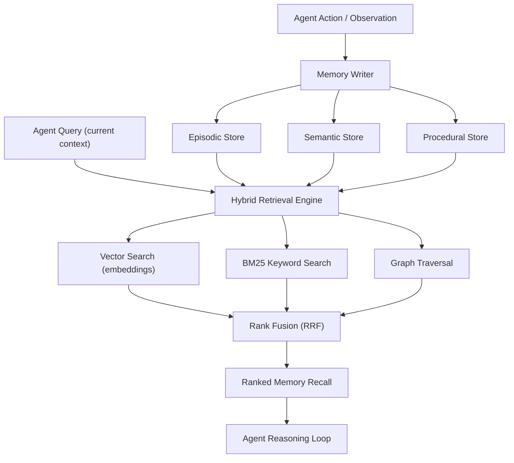

---
title: "Building a Universal Memory Layer for AI Agents"
description: "Learn to architect scalable memory systems for AI agents — covering episodic, semantic, and procedural stores, hybrid retrieval, and multi-agent state sharing."
pubDate: 2026-02-18
author: "Varun Pratap Bhardwaj"
tags: ["ai-agents", "agent-memory", "vector-search", "hybrid-retrieval"]
category: "education"
image: "/assets/blog/building-universal-memory-layer-for-ai-agents-hero.png"
draft: false
slug: "building-universal-memory-layer-for-ai-agents"
---

import Callout from '../../components/blog/Callout.astro';
import StepList from '../../components/blog/StepList.astro';
import ComparisonTable from '../../components/blog/ComparisonTable.astro';

Most AI agents today are stateless. They receive a prompt, produce a response, and forget everything. The moment a conversation ends or a workflow completes, all accumulated context evaporates. This is fine for single-turn tasks, but it falls apart the moment you need an agent to learn from past interactions, coordinate with other agents, or maintain continuity across sessions.

A universal memory layer solves this. It is the infrastructure that lets agents persist context, retrieve relevant past experiences, share knowledge with other agents, and improve their behavior over time. Think of it as the difference between a colleague with amnesia and one who remembers every project you have worked on together.

This post teaches you how to design and build that layer from scratch.

<Callout type="info" title="What You Will Learn">

- The three fundamental memory types for AI agents: episodic, semantic, and procedural
- How to store and index each memory type for fast, relevant retrieval
- Hybrid retrieval strategies that combine vector search, keyword matching, and graph traversal
- State management patterns for multi-agent workflows
- Runnable Python code for a working memory layer prototype
- Trade-offs and failure modes you will encounter in production

</Callout>

## Why Agents Need Memory: First Principles

To understand why memory matters, consider what happens without it. An agent tasked with debugging a codebase will re-read the same files, ask the same clarifying questions, and re-discover the same patterns every single time it is invoked. It cannot build on prior findings.

Human cognition relies on multiple memory systems working together. Cognitive science broadly categorizes these as episodic memory (specific experiences), semantic memory (general knowledge and facts), and procedural memory (learned skills and routines). AI agent architectures benefit from a similar decomposition.

This is not a new observation. The paper [Architectures for Building Agentic AI](https://arxiv.org/abs/2512.09458v1) by Nowaczyk (2025) explicitly lists memory as a core component alongside goal managers, planners, and tool routers. The argument is that reliability in agentic systems is "chiefly an architectural property" — and memory architecture is a large part of that.

## The Three Memory Types

Each memory type serves a different function, has different storage characteristics, and requires different retrieval strategies.

### Episodic Memory

Episodic memory stores specific events and interactions. Each record captures what happened, when, in what context, and what the outcome was. This is the agent's autobiography.

Examples: "User asked me to refactor the auth module on Tuesday. I suggested extracting a middleware layer. They accepted the suggestion and the PR was merged." Each entry is timestamped, attributed, and often includes metadata like the agent's confidence level or the user's satisfaction signal.

### Semantic Memory

Semantic memory stores facts, concepts, and relationships independent of when they were learned. It is the agent's knowledge base.

Examples: "The production database uses PostgreSQL 16. The team prefers functional React components. The API rate limit is 1000 requests per minute." These facts have no temporal anchor — they are true until updated.

### Procedural Memory

Procedural memory stores learned patterns, workflows, and decision-making heuristics. It is the agent's skill set.

Examples: "When deploying to staging, always run the integration test suite first. When the user says 'make it faster,' check for N+1 queries before suggesting caching." These are not facts or events — they are compiled strategies derived from repeated experience.

<ComparisonTable>

| Dimension | Episodic | Semantic | Procedural |
|-----------|----------|----------|------------|
| Content | Specific events, interactions | Facts, concepts, relationships | Workflows, heuristics, strategies |
| Structure | Timestamped records with context | Key-value or graph-structured | Condition-action rules or templates |
| Retrieval | Temporal + similarity search | Exact match + semantic search | Pattern matching on context |
| Update pattern | Append-only (immutable events) | Upsert (facts change) | Refine over time (versioned) |
| Storage size | Grows linearly with usage | Bounded by domain scope | Relatively compact |

</ComparisonTable>

## Architecture: How the Memory Layer Works

The memory layer sits between the agent's reasoning loop and persistent storage. Every agent action can write to memory. Every agent decision can read from memory. The retrieval system must return the most relevant memories given the current context, not just the most recent ones.



The write path classifies incoming information into the appropriate store. The read path runs multiple retrieval strategies in parallel and fuses their results into a single ranked list.

## Practical Implementation

Let us build a working memory layer in Python. We will use SQLite for structured storage, a vector index for embedding-based search, and a simple rank fusion algorithm to combine results.

### Step 1: Define the Memory Schema

<StepList number={1} title="Define memory record structures">

Each memory type gets its own schema. We use dataclasses for clarity.

```python
from dataclasses import dataclass, field
from datetime import datetime
from typing import Optional
import uuid
import json

@dataclass
class EpisodicMemory:
    content: str
    context: dict  # e.g., {"task": "refactor", "user": "alice"}
    outcome: Optional[str] = None
    timestamp: datetime = field(default_factory=datetime.utcnow)
    memory_id: str = field(default_factory=lambda: str(uuid.uuid4()))
    memory_type: str = "episodic"

@dataclass
class SemanticMemory:
    subject: str       # e.g., "production_database"
    predicate: str     # e.g., "uses"
    obj: str           # e.g., "PostgreSQL 16"
    confidence: float = 1.0
    source: str = ""   # where was this learned
    memory_id: str = field(default_factory=lambda: str(uuid.uuid4()))
    memory_type: str = "semantic"

@dataclass
class ProceduralMemory:
    condition: str     # when to apply this procedure
    action: str        # what to do
    success_count: int = 0
    failure_count: int = 0
    memory_id: str = field(default_factory=lambda: str(uuid.uuid4()))
    memory_type: str = "procedural"
```

The `context` field on episodic memories is critical. It captures the situation in which the event occurred, enabling retrieval by context similarity rather than just keyword matching.

</StepList>

### Step 2: Build the Storage Backend

<StepList number={2} title="Implement storage with SQLite and a vector index">

We use SQLite for structured data and `numpy` for a minimal in-memory vector index. In production, you would swap the vector index for something like Qdrant, Weaviate, or pgvector.

```python
import sqlite3
import numpy as np
from typing import List, Tuple

class MemoryStore:
    def __init__(self, db_path: str = ":memory:"):
        self.conn = sqlite3.connect(db_path)
        self._init_tables()
        # In-memory vector index: list of (memory_id, embedding)
        self.vector_index: List[Tuple[str, np.ndarray]] = []

    def _init_tables(self):
        self.conn.executescript("""
            CREATE TABLE IF NOT EXISTS episodic (
                memory_id TEXT PRIMARY KEY,
                content TEXT,
                context TEXT,
                outcome TEXT,
                timestamp TEXT
            );
            CREATE TABLE IF NOT EXISTS semantic (
                memory_id TEXT PRIMARY KEY,
                subject TEXT,
                predicate TEXT,
                obj TEXT,
                confidence REAL,
                source TEXT
            );
            CREATE TABLE IF NOT EXISTS procedural (
                memory_id TEXT PRIMARY KEY,
                condition_text TEXT,
                action_text TEXT,
                success_count INTEGER,
                failure_count INTEGER
            );
            CREATE VIRTUAL TABLE IF NOT EXISTS memory_fts
                USING fts5(memory_id, content, tokenize='porter');
        """)

    def write_episodic(self, mem: "EpisodicMemory", embedding: np.ndarray):
        self.conn.execute(
            "INSERT INTO episodic VALUES (?, ?, ?, ?, ?)",
            (mem.memory_id, mem.content, json.dumps(mem.context),
             mem.outcome, mem.timestamp.isoformat())
        )
        # Index for full-text search
        self.conn.execute(
            "INSERT INTO memory_fts VALUES (?, ?)",
            (mem.memory_id, mem.content)
        )
        self.conn.commit()
        # Add to vector index
        self.vector_index.append((mem.memory_id, embedding))

    def write_semantic(self, mem: "SemanticMemory", embedding: np.ndarray):
        # Upsert: if same subject+predicate exists, update it
        self.conn.execute(
            """INSERT INTO semantic VALUES (?, ?, ?, ?, ?, ?)
               ON CONFLICT(memory_id) DO UPDATE SET
               obj=excluded.obj, confidence=excluded.confidence""",
            (mem.memory_id, mem.subject, mem.predicate,
             mem.obj, mem.confidence, mem.source)
        )
        text = f"{mem.subject} {mem.predicate} {mem.obj}"
        self.conn.execute(
            "INSERT INTO memory_fts VALUES (?, ?)",
            (mem.memory_id, text)
        )
        self.conn.commit()
        self.vector_index.append((mem.memory_id, embedding))
```

Note that we write every memory record into both the structured table and the full-text search index. This enables hybrid retrieval.

</StepList>

### Step 3: Implement Hybrid Retrieval

<StepList number={3} title="Build the retrieval engine with rank fusion">

The retrieval engine runs two search strategies — vector similarity and BM25 keyword matching — then combines them using Reciprocal Rank Fusion (RRF). RRF is a simple, effective algorithm: for each document, sum `1 / (k + rank)` across all retrieval methods, where `k` is a constant (typically 60).

```python
def cosine_similarity(a: np.ndarray, b: np.ndarray) -> float:
    """Compute cosine similarity between two vectors."""
    dot = np.dot(a, b)
    norm = np.linalg.norm(a) * np.linalg.norm(b)
    if norm == 0:
        return 0.0
    return float(dot / norm)

class HybridRetriever:
    def __init__(self, store: MemoryStore, k: int = 60):
        self.store = store
        self.k = k  # RRF constant

    def vector_search(self, query_embedding: np.ndarray,
                      top_n: int = 10) -> List[Tuple[str, float]]:
        """Return (memory_id, score) pairs ranked by cosine similarity."""
        scores = []
        for memory_id, emb in self.store.vector_index:
            sim = cosine_similarity(query_embedding, emb)
            scores.append((memory_id, sim))
        scores.sort(key=lambda x: x[1], reverse=True)
        return scores[:top_n]

    def bm25_search(self, query_text: str,
                    top_n: int = 10) -> List[Tuple[str, float]]:
        """Use SQLite FTS5 built-in ranking for BM25 search."""
        cursor = self.store.conn.execute(
            """SELECT memory_id, rank FROM memory_fts
               WHERE memory_fts MATCH ?
               ORDER BY rank LIMIT ?""",
            (query_text, top_n)
        )
        # FTS5 rank is negative (lower = better), so we negate for consistency
        return [(row[0], -row[1]) for row in cursor.fetchall()]

    def retrieve(self, query_text: str, query_embedding: np.ndarray,
                 top_n: int = 5) -> List[Tuple[str, float]]:
        """Hybrid retrieval using Reciprocal Rank Fusion."""
        vec_results = self.vector_search(query_embedding, top_n=20)
        bm25_results = self.bm25_search(query_text, top_n=20)

        # Build rank maps: memory_id -> rank position (1-indexed)
        rrf_scores: dict = {}

        for rank, (memory_id, _) in enumerate(vec_results, start=1):
            rrf_scores[memory_id] = rrf_scores.get(memory_id, 0) + \
                                     1.0 / (self.k + rank)

        for rank, (memory_id, _) in enumerate(bm25_results, start=1):
            rrf_scores[memory_id] = rrf_scores.get(memory_id, 0) + \
                                     1.0 / (self.k + rank)

        # Sort by fused score, descending
        ranked = sorted(rrf_scores.items(), key=lambda x: x[1], reverse=True)
        return ranked[:top_n]
```

The RRF approach is attractive because it does not require normalizing scores across different retrieval methods. Each method produces a ranked list, and RRF combines the ranks. This was first described by Cormack, Clarke, and Butt (2009) and remains widely used in production search systems.

</StepList>

### Step 4: Wire It Together

<StepList number={4} title="Complete the memory layer with a unified API">

Here is the unified interface an agent would use:

```python
# Simulated embedding function (replace with a real model in production)
def embed(text: str) -> np.ndarray:
    """Produce a deterministic pseudo-embedding for demonstration."""
    np.random.seed(hash(text) % 2**32)
    return np.random.randn(384).astype(np.float32)

# Initialize
store = MemoryStore()
retriever = HybridRetriever(store)

# Agent learns a fact (semantic memory)
fact = SemanticMemory(
    subject="production_db",
    predicate="runs_on",
    obj="PostgreSQL 16"
)
store.write_semantic(fact, embed(f"{fact.subject} {fact.predicate} {fact.obj}"))

# Agent records an interaction (episodic memory)
episode = EpisodicMemory(
    content="User requested migration from MySQL to PostgreSQL. "
            "I generated migration scripts and validated schema compatibility.",
    context={"task": "database_migration", "user": "alice"},
    outcome="success"
)
store.write_episodic(episode, embed(episode.content))

# Later: agent needs to recall relevant context
query = "What do I know about the production database?"
results = retriever.retrieve(query, embed(query), top_n=3)

for memory_id, score in results:
    print(f"Memory {memory_id[:8]}... | RRF Score: {score:.4f}")
```

Expected output (memory IDs will vary):

```
Memory 3a7f2c1e... | RRF Score: 0.0328
Memory b9d41e8a... | RRF Score: 0.0164
```

The top result is the semantic fact about PostgreSQL, and the second is the episodic memory about the migration — both relevant to the query.

</StepList>

<Callout type="warning" title="Embedding Quality Matters More Than You Think">

The pseudo-embedding function above is for demonstration only. In production, use a proper embedding model (e.g., `text-embedding-3-small` from OpenAI, or an open-source model like `bge-base-en-v1.5`). The quality of your embeddings directly determines the quality of vector search results. Poor embeddings will surface irrelevant memories no matter how sophisticated your retrieval pipeline is.

</Callout>

## Multi-Agent State Sharing

When multiple agents collaborate — say, a research agent and a coding agent working on the same task — they need shared access to the memory layer. This introduces two challenges: consistency and trust.

### Consistency

If Agent A writes a memory and Agent B reads it milliseconds later, is the memory visible? For most agentic workloads, eventual consistency is acceptable. Agents are not running real-time trading systems; a few hundred milliseconds of propagation delay is fine. Use a shared database (PostgreSQL with pgvector, for instance) and rely on its default isolation level.

### Trust Scoring

Not all memories are equally reliable. An agent that has been wrong frequently should have its memories weighted lower. A simple trust model assigns each agent a trust score and multiplies it into the retrieval ranking:

```python
@dataclass
class AgentTrustProfile:
    agent_id: str
    correct_predictions: int = 0
    total_predictions: int = 0

    @property
    def trust_score(self) -> float:
        if self.total_predictions == 0:
            return 0.5  # neutral prior
        return self.correct_predictions / self.total_predictions

def trust_weighted_retrieve(
    retriever: HybridRetriever,
    query_text: str,
    query_embedding: np.ndarray,
    memory_author_map: dict,  # memory_id -> agent_id
    trust_profiles: dict,     # agent_id -> AgentTrustProfile
    top_n: int = 5
) -> List[Tuple[str, float]]:
    """Re-rank retrieval results by trust-weighted scores."""
    raw_results = retriever.retrieve(query_text, query_embedding, top_n=20)
    weighted = []
    for memory_id, rrf_score in raw_results:
        agent_id = memory_author_map.get(memory_id, "unknown")
        trust = trust_profiles.get(agent_id, AgentTrustProfile(agent_id)).trust_score
        weighted.append((memory_id, rrf_score * trust))
    weighted.sort(key=lambda x: x[1], reverse=True)
    return weighted[:top_n]
```

This gets tricky because trust is domain-dependent. An agent might be highly reliable for code reviews but unreliable for cost estimation. A more sophisticated approach partitions trust scores by task category, but the simple version above is a reasonable starting point.

<Callout type="danger" title="Unbounded Memory Growth Will Degrade Performance">

Every write to the memory layer increases storage and slows down retrieval. Without a garbage collection strategy, your vector index will grow until search latency becomes unacceptable. Implement a decay mechanism: older episodic memories that have not been accessed in a long time should be archived or summarized. Semantic memories should be periodically validated. Procedural memories with high failure counts should be retired.

</Callout>

## Seeing This in Practice

The architecture described above — episodic, semantic, and procedural stores with hybrid retrieval and multi-agent trust scoring — is implemented in [SuperLocalMemory](https://github.com/superlocalai/superlocalmemory), a local-first memory layer for AI agents. It stores all data on your machine (no cloud dependency), supports shared memory across different AI tools like OpenAI, Claude, and Gemini, and implements the trust-weighted retrieval pattern shown above.

You can inspect how it handles cross-agent memory sharing by looking at the memory write path:

```bash
# Clone the repository and explore the memory layer
git clone https://github.com/superlocalai/superlocalmemory.git
cd superlocalmemory

# The core memory store implementation lives in:
# src/memory/store.ts — episodic, semantic, procedural writes
# src/retrieval/hybrid.ts — vector + BM25 rank fusion
# src/trust/scoring.ts — per-agent trust profiles
```

The codebase follows the same architectural pattern described in this post: classify on write, search across all stores on read, fuse results with RRF, and apply trust weighting based on the authoring agent's track record. It is a useful reference implementation if you want to see how these ideas translate to production TypeScript.

## Real-World Considerations

### When NOT to Build a Memory Layer

If your agent handles stateless, one-shot tasks (like "translate this sentence" or "format this JSON"), a memory layer adds complexity with no benefit. Memory layers pay off when agents operate across sessions, collaborate with other agents, or need to improve over time.

### Storage Backend Choice

<ComparisonTable>

| Backend | Vector Search | Keyword Search | Graph Queries | Operational Complexity |
|---------|--------------|----------------|---------------|----------------------|
| PostgreSQL + pgvector | Good (HNSW index) | Built-in FTS | Requires CTEs or extensions | Low (one database) |
| Qdrant + SQLite | Excellent | Separate system | Not built-in | Medium (two systems) |
| Neo4j + vector index | Moderate | Lucene-based | Excellent | High (specialized) |
| In-memory (dev/prototyping) | Fast, no persistence | Simple | Manual | Minimal |

</ComparisonTable>

For most teams, PostgreSQL with pgvector is the pragmatic choice. It handles vector search, keyword search, and structured queries in a single system. You lose some vector search performance compared to a dedicated engine, but you gain operational simplicity.

### Embedding Dimensionality vs. Retrieval Speed

Higher-dimensional embeddings capture more nuance but slow down similarity search. With HNSW indexes, search is approximately O(log n) regardless of dimension, but the constant factor grows linearly with dimension size. For most agent memory use cases, 384 or 768 dimensions are sufficient. Going to 1536 or 3072 dimensions rarely justifies the increased storage and compute costs.

### Memory Conflicts

Two agents might write contradictory semantic memories: Agent A says "the API uses OAuth 2.0" while Agent B says "the API uses API keys." Your memory layer needs a conflict resolution strategy. Options include: latest-write-wins, trust-weighted resolution (prefer the higher-trust agent), or flagging the conflict for human review.

<Callout type="warning" title="Do Not Treat All Memory Types Identically">

A common mistake is dumping everything into a single vector store and hoping retrieval will sort it out. Episodic, semantic, and procedural memories have fundamentally different update patterns and query profiles. Episodic memories are append-only and queried by temporal context. Semantic memories are upserted and queried by entity. Procedural memories are versioned and queried by situational match. Mixing them into one index degrades retrieval quality for all three.

</Callout>

## Further Reading and Sources

- [Architectures for Building Agentic AI](https://arxiv.org/abs/2512.09458v1) by Nowaczyk (2025) — a thorough treatment of agentic system components including memory, with emphasis on reliability as an architectural property
- [Foundations of GenIR](https://arxiv.org/abs/2501.02842v1) by Ai, Zhan, Liu (2025) — covers how generative AI models change information access paradigms, relevant to understanding retrieval in agent contexts
- [Safe, Untrusted, "Proof-Carrying" AI Agents](https://arxiv.org/abs/2510.09567v1) by Tagliabue and Greco (2025) — discusses trust and governance in agentic workflows, directly relevant to multi-agent memory sharing
- [Reciprocal Rank Fusion](https://plg.uwaterloo.ca/~gvcormac/cormacksigir09-rrf.pdf) by Cormack, Clarke, and Butt (2009) — the original RRF paper, still the go-to algorithm for combining ranked lists
- [Semantica](https://news.ycombinator.com/item?id=46452014) — an open-source semantic layer and GraphRAG framework relevant to graph-based memory retrieval
- [pgvector documentation](https://github.com/pgvector/pgvector) — if you choose PostgreSQL as your storage backend, this is essential reading for vector index configuration

<Callout type="tip" title="Key Takeaways">

- **Three memory types, three stores.** Episodic (events), semantic (facts), and procedural (skills) memories have different storage, update, and retrieval characteristics. Design for each independently.
- **Hybrid retrieval beats any single method.** Combining vector search with BM25 keyword matching using Reciprocal Rank Fusion consistently outperforms either approach alone.
- **Trust scoring is essential for multi-agent systems.** When multiple agents write to shared memory, weight retrieval results by the authoring agent's track record to surface reliable information first.
- **Start with PostgreSQL + pgvector.** One database that handles structured storage, full-text search, and vector similarity is operationally simpler than stitching together three specialized systems.
- **Plan for memory decay.** Unbounded memory growth degrades retrieval quality and performance. Implement archival, summarization, and retirement strategies from the start.

</Callout>