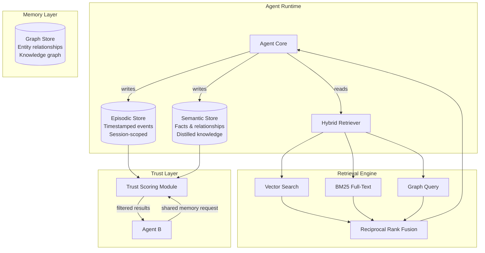

---
title: "Building a Universal Memory Layer for AI Agents: Architecture Patterns for Scalable State Management"
description: "Learn to architect a memory layer for AI agents with episodic and semantic stores, hybrid retrieval, and inter-agent trust scoring."
pubDate: 2026-02-19
author: "Varun Pratap Bhardwaj"
tags: ["ai-agents", "agent-memory", "vector-search", "hybrid-search"]
category: "education"
image: "/assets/blog/universal-memory-layer-ai-agents-architecture-patterns-hero.png"
draft: false
slug: "universal-memory-layer-ai-agents-architecture-patterns"
---

import Callout from '../../components/blog/Callout.astro';
import StepList from '../../components/blog/StepList.astro';
import ComparisonTable from '../../components/blog/ComparisonTable.astro';

AI agents that cannot remember are AI agents that cannot improve. Every time your agent starts a new session, it loses the context it accumulated in the last one. It forgets user preferences, prior decisions, the results of tool calls, and the reasoning chains that led to good outcomes. If you are building agents that interact with users or collaborate with other agents across sessions, you need a memory layer — a structured, queryable persistence system that stores what the agent has learned and makes it retrievable at inference time.

This is not a trivial caching problem. Agent memory requires careful design decisions around what to store (raw episodes vs. distilled knowledge), how to retrieve it (vector similarity vs. keyword matching vs. graph traversal), and how to share it safely between agents that may not fully trust each other.

<Callout type="info" title="What You Will Learn">

- The difference between episodic and semantic memory stores for AI agents, and when to use each
- How to implement hybrid retrieval combining vector search, BM25 full-text search, and graph-based lookups
- A trust scoring model for inter-agent memory sharing
- Concrete Python code for building each component
- Trade-offs and failure modes you will encounter in production

</Callout>

## Conceptual Foundation: How Agents Think About Memory

Cognitive science distinguishes between several types of human memory. Two categories translate directly to agent architectures: **episodic memory** and **semantic memory**.

**Episodic memory** stores specific events in sequence. "The user asked me to summarize the Q3 report on Tuesday. I called the document retrieval tool, received a 12-page PDF, and returned a 300-word summary that the user rated as helpful." Each record is timestamped, tied to a session, and preserves the full context of what happened.

**Semantic memory** stores distilled facts and relationships. "The user prefers concise summaries under 500 words. The Q3 report is stored in the finance SharePoint folder. Summaries should use bullet points." These are generalizations extracted from episodes — they lose temporal specificity but gain reusability.

Most production agent systems need both. Episodic memory gives you auditability and the ability to replay decisions. Semantic memory gives you fast, general-purpose knowledge retrieval without scanning through thousands of past events.



As Nowaczyk argues in [Architectures for Building Agentic AI](https://arxiv.org/abs/2512.09458v1), reliability in agentic systems emerges from "principled componentisation" — separating the memory subsystem from the planner, executor, and tool router with disciplined interfaces. The memory layer is one such component, and it deserves its own architecture.

## How It Works: Designing the Memory Schema

Before writing any retrieval code, you need to decide what a memory record looks like. Here is a schema that supports both episodic and semantic records in a single store:

```python
from dataclasses import dataclass, field
from datetime import datetime
from typing import Optional
from enum import Enum

class MemoryType(Enum):
    EPISODIC = "episodic"
    SEMANTIC = "semantic"

@dataclass
class MemoryRecord:
    id: str
    agent_id: str                          # which agent created this
    memory_type: MemoryType
    content: str                           # the actual memory text
    embedding: Optional[list[float]] = None  # vector embedding for similarity search
    metadata: dict = field(default_factory=dict)  # flexible key-value pairs
    session_id: Optional[str] = None       # episodic memories are session-scoped
    trust_score: float = 1.0               # 0.0 to 1.0 — how much to trust this record
    created_at: datetime = field(default_factory=datetime.utcnow)
    access_count: int = 0                  # track retrieval frequency for decay
    source_agent_ids: list[str] = field(default_factory=list)  # provenance chain
```

A few design choices worth noting. The `trust_score` field allows downstream consumers to weight memories differently based on their origin. The `source_agent_ids` list tracks provenance — if Agent A wrote a memory that Agent B distilled into a semantic fact, both IDs are recorded. The `access_count` enables memory decay: records that are never retrieved can be archived or deleted.

<Callout type="warning" title="Do Not Store Raw Embeddings in Your Primary Database">

Storing high-dimensional float vectors (768 or 1536 dimensions) alongside your relational data will bloat your primary database and slow down non-vector queries. Use a dedicated vector store (pgvector, Qdrant, Weaviate, Milvus) and link records by ID. Your relational store holds metadata and content; your vector store holds embeddings and supports approximate nearest neighbor (ANN) search.

</Callout>

## Practical Implementation: Building the Retrieval Engine

The most common mistake in agent memory systems is relying solely on vector similarity search. Vector search excels at finding semantically related content, but it struggles with exact keyword matches, entity names, and structured filters. A hybrid approach combines multiple retrieval strategies and fuses their results.

### Step 1: Set Up the Stores

<StepList number={1} title="Initialize the Vector Store and Full-Text Index">

We will use `qdrant-client` for vector search and a simple BM25 implementation via `rank_bm25` for full-text retrieval. In production, you might use Elasticsearch or Typesense for BM25, but this keeps things self-contained.

```bash
pip install qdrant-client rank-bm25 sentence-transformers numpy
```

```python
from qdrant_client import QdrantClient
from qdrant_client.models import Distance, VectorParams, PointStruct
from sentence_transformers import SentenceTransformer
import uuid

# Initialize embedding model
embedder = SentenceTransformer("all-MiniLM-L6-v2")  # 384-dim, fast, good baseline
VECTOR_DIM = 384

# Initialize Qdrant (in-memory for development)
qdrant = QdrantClient(":memory:")
qdrant.create_collection(
    collection_name="agent_memory",
    vectors_config=VectorParams(size=VECTOR_DIM, distance=Distance.COSINE),
)
```

</StepList>

<StepList number={2} title="Write Memories to Both Stores">

Every time the agent stores a memory, it writes to both the vector store (for semantic retrieval) and a BM25 index (for keyword retrieval).

```python
from rank_bm25 import BM25Okapi
from datetime import datetime

# In-memory BM25 corpus (in production, use a search engine)
bm25_corpus = []       # list of tokenized documents
bm25_metadata = []     # parallel list of memory IDs
bm25_index = None       # will be rebuilt on each insert (naive; batch in production)

def store_memory(record: MemoryRecord) -> str:
    """Store a memory record in both vector and full-text indices."""
    # Generate embedding
    record.embedding = embedder.encode(record.content).tolist()
    record.id = record.id or str(uuid.uuid4())

    # Write to Qdrant
    qdrant.upsert(
        collection_name="agent_memory",
        points=[
            PointStruct(
                id=record.id,
                vector=record.embedding,
                payload={
                    "content": record.content,
                    "agent_id": record.agent_id,
                    "memory_type": record.memory_type.value,
                    "trust_score": record.trust_score,
                    "session_id": record.session_id,
                    "created_at": record.created_at.isoformat(),
                },
            )
        ],
    )

    # Update BM25 index
    global bm25_index
    tokens = record.content.lower().split()
    bm25_corpus.append(tokens)
    bm25_metadata.append(record.id)
    bm25_index = BM25Okapi(bm25_corpus)

    return record.id
```

</StepList>

<StepList number={3} title="Implement Hybrid Retrieval with Reciprocal Rank Fusion">

Reciprocal Rank Fusion (RRF) is a simple, effective method for merging ranked lists from different retrieval systems. For each document appearing at rank `r` in a results list, its RRF score is `1 / (k + r)` where `k` is a smoothing constant (typically 60). You sum RRF scores across all lists.

```python
def hybrid_search(query: str, top_k: int = 5, rrf_k: int = 60) -> list[dict]:
    """
    Perform hybrid search combining vector similarity and BM25 keyword matching.
    Returns fused results ranked by Reciprocal Rank Fusion score.
    """
    # Vector search
    query_embedding = embedder.encode(query).tolist()
    vector_results = qdrant.search(
        collection_name="agent_memory",
        query_vector=query_embedding,
        limit=top_k * 2,  # over-fetch for fusion
    )
    
    # BM25 search
    bm25_results = []
    if bm25_index is not None:
        query_tokens = query.lower().split()
        bm25_scores = bm25_index.get_scores(query_tokens)
        # Get top indices sorted by score descending
        ranked_indices = sorted(
            range(len(bm25_scores)),
            key=lambda i: bm25_scores[i],
            reverse=True,
        )[: top_k * 2]
        bm25_results = [bm25_metadata[i] for i in ranked_indices if bm25_scores[i] > 0]
    
    # Reciprocal Rank Fusion
    rrf_scores = {}
    
    for rank, hit in enumerate(vector_results):
        doc_id = hit.id
        rrf_scores[doc_id] = rrf_scores.get(doc_id, 0) + 1.0 / (rrf_k + rank + 1)
    
    for rank, doc_id in enumerate(bm25_results):
        rrf_scores[doc_id] = rrf_scores.get(doc_id, 0) + 1.0 / (rrf_k + rank + 1)
    
    # Sort by fused score
    ranked_ids = sorted(rrf_scores, key=rrf_scores.get, reverse=True)[:top_k]
    
    # Fetch full records from Qdrant
    results = []
    for doc_id in ranked_ids:
        points = qdrant.retrieve(collection_name="agent_memory", ids=[doc_id])
        if points:
            p = points[0]
            results.append({
                "id": p.id,
                "content": p.payload["content"],
                "rrf_score": rrf_scores[doc_id],
                "trust_score": p.payload["trust_score"],
                "memory_type": p.payload["memory_type"],
            })
    
    return results
```

</StepList>

Let us test this with a concrete example:

```python
# Store some memories
store_memory(MemoryRecord(
    id="m1",
    agent_id="agent-alpha",
    memory_type=MemoryType.EPISODIC,
    content="User requested a summary of the Q3 financial report. Used document_retrieval tool. User rated output 4/5.",
    session_id="session-001",
))

store_memory(MemoryRecord(
    id="m2",
    agent_id="agent-alpha",
    memory_type=MemoryType.SEMANTIC,
    content="User prefers summaries under 500 words with bullet points. Finance documents are in SharePoint.",
))

store_memory(MemoryRecord(
    id="m3",
    agent_id="agent-beta",
    memory_type=MemoryType.SEMANTIC,
    content="The Q3 report showed revenue growth of 12% year-over-year. Operating margin declined to 18%.",
    trust_score=0.8,  # lower trust — came from a different agent
))

# Query
results = hybrid_search("Q3 financial report summary preferences")
for r in results:
    print(f"[{r['memory_type']}] (trust={r['trust_score']}, rrf={r['rrf_score']:.4f}) {r['content'][:80]}...")
```

Expected output (ordering may vary slightly):

```
[semantic] (trust=1.0, rrf=0.0325) User prefers summaries under 500 words with bullet points. Finance documents...
[episodic] (trust=1.0, rrf=0.0323) User requested a summary of the Q3 financial report. Used document_retrieval...
[semantic] (trust=0.8, rrf=0.0161) The Q3 report showed revenue growth of 12% year-over-year. Operating margin d...
```

<ComparisonTable>

| Retrieval Method | Strengths | Weaknesses | Best For |
|-----------------|-----------|------------|----------|
| Vector Search (ANN) | Finds semantically similar content even with different wording | Misses exact keyword matches; requires embedding model | Open-ended queries, concept matching |
| BM25 Full-Text | Precise keyword and entity matching; no ML model needed | Cannot handle synonyms or paraphrases | Named entities, IDs, exact terms |
| Graph Query | Traverses relationships between entities; finds multi-hop connections | Requires a maintained knowledge graph; schema overhead | Entity relationships, reasoning chains |
| Hybrid (RRF) | Combines strengths of all methods; robust across query types | Added complexity; tuning the fusion weights | Production systems needing reliability |

</ComparisonTable>

## Inter-Agent Memory Sharing with Trust Scoring

When multiple agents share a memory layer, you face a trust problem. Agent A might store a fact that Agent B relies on for a critical decision. But what if Agent A was hallucinating, or working from outdated data?

Trust scoring addresses this by assigning a confidence weight to each memory based on its provenance, age, and verification status. Here is a practical model:

```python
from dataclasses import dataclass
from datetime import datetime, timedelta

@dataclass
class TrustPolicy:
    """Defines how an agent evaluates trust in shared memories."""
    trusted_agents: dict[str, float]      # agent_id -> base trust (0.0 to 1.0)
    max_age_days: int = 30                # memories older than this get decayed
    age_decay_rate: float = 0.02          # trust loss per day past max_age
    min_trust_threshold: float = 0.3      # memories below this are filtered out
    verification_bonus: float = 0.15      # bonus if memory was verified by another agent

def compute_trust(
    record: MemoryRecord,
    policy: TrustPolicy,
    current_time: datetime = None,
) -> float:
    """
    Compute effective trust score for a memory record given a consuming agent's policy.
    """
    current_time = current_time or datetime.utcnow()

    # Base trust from the originating agent
    base_trust = policy.trusted_agents.get(record.agent_id, 0.5)  # default: moderate trust

    # Age decay
    age_days = (current_time - record.created_at).days
    age_penalty = max(0, age_days - policy.max_age_days) * policy.age_decay_rate
    
    # Verification bonus: if multiple agents contributed, memory is more trustworthy
    verification = policy.verification_bonus if len(record.source_agent_ids) > 1 else 0.0

    # Original record trust (set by the writing agent)
    origin_trust = record.trust_score

    # Composite score
    effective_trust = (base_trust * 0.4 + origin_trust * 0.4 + verification * 0.2) - age_penalty
    return max(0.0, min(1.0, effective_trust))  # clamp to [0, 1]


def filtered_search(
    query: str,
    policy: TrustPolicy,
    top_k: int = 5,
) -> list[dict]:
    """Search memories and filter by trust policy."""
    raw_results = hybrid_search(query, top_k=top_k * 3)  # over-fetch before filtering
    
    scored = []
    for r in raw_results:
        # Reconstruct a minimal record for trust computation
        record = MemoryRecord(
            id=r["id"],
            agent_id=r.get("agent_id", "unknown"),
            memory_type=MemoryType(r["memory_type"]),
            content=r["content"],
            trust_score=r["trust_score"],
            created_at=datetime.fromisoformat(r.get("created_at", datetime.utcnow().isoformat())),
            source_agent_ids=r.get("source_agent_ids", []),
        )
        trust = compute_trust(record, policy)
        if trust >= policy.min_trust_threshold:
            r["effective_trust"] = trust
            scored.append(r)
    
    # Re-rank by effective trust * retrieval relevance
    scored.sort(key=lambda x: x["effective_trust"] * x["rrf_score"], reverse=True)
    return scored[:top_k]
```

<Callout type="info" title="Why Multiply Trust by Relevance?">

A highly trusted but irrelevant memory is useless. A highly relevant but untrusted memory is dangerous. Multiplying the trust score by the retrieval relevance score ensures that both dimensions must be reasonably high for a memory to surface. This is a simple weighted product — in production, you might learn these weights from user feedback or agent outcome data.

</Callout>

## Seeing This in Practice

The architecture described above — episodic and semantic stores, hybrid retrieval with RRF, and trust-scored inter-agent sharing — is implemented in [SuperLocalMemory](https://github.com/SuperLocalMemory/superlocalmemorymvp). The project provides a working reference for multi-agent memory with trust scoring and shared state across AI tools like OpenAI, Claude, and Gemini.

You can inspect how the trust scoring module gates memory access between agents and how the hybrid retriever fuses BM25 and vector results. The codebase uses the same pattern of separating episodic and semantic stores with a unified query interface.

```bash
# Clone and explore the reference implementation
git clone https://github.com/SuperLocalMemory/superlocalmemorymvp.git
cd superlocalmemorymvp
# Review the memory layer architecture in /src/memory/
```

This is useful as a starting point if you want to see how the patterns from this post translate into a running system with actual multi-agent coordination.

## Real-World Considerations

### Memory Decay and Garbage Collection

Unbounded memory growth will degrade retrieval quality. As your store grows, vector search returns more marginally-relevant results, and BM25 produces noisier rankings. Implement a decay strategy.

One practical approach: run a nightly job that reduces the trust score of memories by a small amount (say 0.01 per day). When a memory drops below a threshold (say 0.1), archive it to cold storage. Memories that are accessed frequently get their decay reset. This mimics how human memory consolidation works — frequently recalled memories strengthen, unused ones fade.

### Embedding Model Drift

If you change your embedding model (say, from `all-MiniLM-L6-v2` to `text-embedding-3-small`), every stored vector becomes incompatible with new query vectors. You need to re-embed your entire corpus. Plan for this from day one by keeping the raw text in your store and treating embeddings as a derived, rebuildable index.

<Callout type="danger" title="Never Rely Solely on Embeddings for Storage">

If your vector store fails or your embedding model changes, you must be able to reconstruct the index from source text. Always store the original content string alongside (or instead of) the embedding vector. Treat the vector index as a cache, not a source of truth.

</Callout>

### When Not to Use This Pattern

Not every agent needs a universal memory layer. If your agent is stateless by design (a simple RAG pipeline that answers questions from a fixed document set), adding a memory layer introduces complexity without clear benefit. The memory layer pattern is justified when:

- Agents operate across multiple sessions and need continuity
- Multiple agents collaborate and need shared context
- Users expect personalization that improves over time
- You need auditability of agent decisions (episodic replay)

If none of these apply, a simpler approach — such as passing conversation history in the prompt context window — may be sufficient.

### Latency Budget

Every memory retrieval adds latency to your agent's response. Vector search on Qdrant or pgvector typically runs in 5-50ms for collections under 1M vectors. BM25 on Elasticsearch is similarly fast. But if you are doing hybrid retrieval with fusion plus trust scoring plus re-ranking, you can easily add 100-200ms to each agent turn. Profile your retrieval pipeline and set a latency budget. Consider caching frequent queries.

<Callout type="warning" title="Watch Out for Feedback Loops">

If an agent reads its own memories and uses them to generate new memories that reinforce the same patterns, you can get runaway feedback loops. An agent that once stored "user dislikes verbose answers" might generate increasingly terse responses, each time storing a new memory confirming that short answers are good — even if the user's preferences have changed. Build in mechanisms for memory correction: allow users or supervisors to flag or delete memories.

</Callout>

## Further Reading and Sources

- [Architectures for Building Agentic AI](https://arxiv.org/abs/2512.09458v1) by Nowaczyk (2025) — Argues that reliability in agentic systems is an architectural property, with memory as a first-class component alongside planners and verifiers.
- [Safe, Untrusted, "Proof-Carrying" AI Agents](https://arxiv.org/abs/2510.09567v1) by Tagliabue and Greco (2025) — Discusses trust and governance in agentic workflows, relevant to the trust scoring model described here.
- [Foundations of GenIR](https://arxiv.org/abs/2501.02842v1) by Ai, Zhan, and Liu (2025) — Covers how generative AI models interact with information access systems, providing context for retrieval-augmented agent architectures.
- [Reciprocal Rank Fusion paper](https://plg.uwaterloo.ca/~gvcormac/cormacksigir09-rrf.pdf) by Cormack, Clarke, and Butt (2009) — The original RRF paper, a simple and effective method for fusing ranked lists.
- [Qdrant documentation](https://qdrant.tech/documentation/) — Reference for the vector search engine used in this post's examples.
- [rank-bm25 Python library](https://github.com/dorianbrown/rank_bm25) — The BM25 implementation used in the code examples.
- [Semantica](https://news.ycombinator.com/item?id=46452014) — An open-source semantic layer and GraphRAG framework relevant to the graph-based retrieval component.

<Callout type="tip" title="Key Takeaways">

- **Separate episodic from semantic memory.** Episodic records preserve full context and timeline. Semantic records distill reusable knowledge. You need both for agents that learn across sessions.
- **Use hybrid retrieval, not just vector search.** Combining BM25 keyword matching with vector similarity via Reciprocal Rank Fusion produces more robust results than either method alone.
- **Trust scoring is essential for multi-agent systems.** When agents share memory, each record needs a provenance chain and a trust weight. The consuming agent should filter results against its own trust policy.
- **Treat embeddings as a derived index.** Always store raw text. Embedding models change, vector stores fail, and you need the ability to rebuild.
- **Plan for memory decay.** Unbounded growth degrades retrieval quality. Implement age-based decay with access-count reinforcement to keep the memory store useful.
- **Profile your latency budget.** Hybrid retrieval plus trust scoring can add 100-200ms per query. Cache frequent patterns and set hard latency limits.

</Callout>