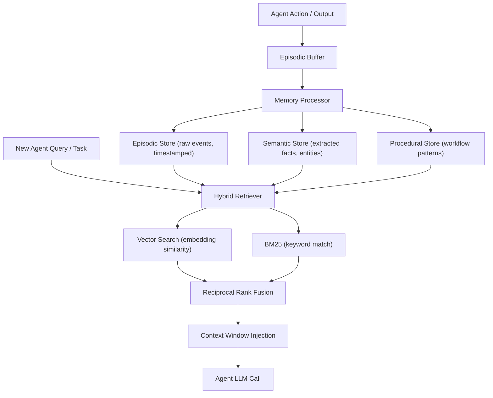

---
title: "Building a Universal Memory Layer for AI Agents: Architecture Patterns for Scalable State Management"
description: "Learn how to architect a memory layer for AI agents, covering episodic vs. semantic stores, hybrid retrieval, and multi-agent interoperability."
pubDate: 2026-02-17
author: "Varun Pratap Bhardwaj"
tags: ["ai-agents", "agent-memory", "state-management", "vector-search", "hybrid-search"]
category: "education"
image: "/assets/blog/universal-memory-layer-ai-agents-architecture-patterns-hero.png"
draft: false
---

import Callout from '../../components/blog/Callout.astro';
import StepList from '../../components/blog/StepList.astro';
import ComparisonTable from '../../components/blog/ComparisonTable.astro';

Every time an AI agent completes a task, it forgets everything. The conversation context vanishes. The user preferences it inferred are gone. The multi-step reasoning chain it constructed dissolves. If you have built anything with LLM-based agents, you have hit this wall: agents are stateless by default, and making them stateful is an unsolved architecture problem for most teams.

This is not the same challenge as caching database queries or managing user sessions. Agent memory requires storing heterogeneous data (facts, episodes, preferences, tool outputs), retrieving it with semantic understanding, and sharing it across agents that may run on different models or frameworks. The patterns you need come from cognitive science as much as from distributed systems.

<Callout type="info" title="What You Will Learn">

- The difference between episodic, semantic, and procedural memory in the context of AI agents
- How to design a write/read pipeline from agent actions through to context window injection
- Concrete retrieval strategies: vector search, BM25, and hybrid ranking with reciprocal rank fusion
- Architecture tradeoffs between local-first and cloud-based memory stores
- How to make memory interoperable across multi-agent systems (OpenAI, Claude, Gemini, open-source)
- When traditional caching or database patterns break down for agent state

</Callout>

## Conceptual Foundation: Why Agent Memory Is Different

Traditional application state management assumes structured data with known schemas. You store a user record, query it by ID, maybe cache it in Redis. The data model is fixed at design time.

Agent memory breaks these assumptions in three ways. First, the data is unstructured and heterogeneous — a memory might be a conversation snippet, a JSON tool result, an inferred user preference, or a reasoning trace. Second, retrieval must be semantic — you cannot query agent memory purely by key; you need to find memories that are *relevant* to the current context, even if they share no lexical overlap. Third, the consumer of this memory is a language model with a finite context window, so you must rank and compress memories before injection.

Cognitive science provides a useful taxonomy that maps well to engineering requirements. Human memory is broadly divided into three systems, and agent memory benefits from the same decomposition.

**Episodic memory** stores specific events and experiences with temporal context. For an agent, this means conversation turns, tool invocations, and their results — the "what happened" log. Episodic memory is append-only and timestamped.

**Semantic memory** stores general knowledge and facts extracted from experiences. When an agent learns that "the user prefers Python over JavaScript" across multiple conversations, that is a semantic memory. It is distilled, deduplicated, and updated over time.

**Procedural memory** stores learned behaviors and patterns — how to accomplish recurring tasks. In agent systems, this might be stored as successful tool-call sequences, prompt templates that worked well, or workflow graphs.

<Callout type="warning" title="Do Not Conflate Agent Memory with RAG">

Retrieval-Augmented Generation (RAG) retrieves from a static knowledge base. Agent memory retrieves from a *dynamic, agent-generated* store that grows with every interaction. The write path matters as much as the read path. If your architecture only handles reads from a pre-indexed corpus, you do not have agent memory — you have document search.

</Callout>

## How It Works: The Memory Write/Read Pipeline

The core architecture has two pipelines: a write path that processes agent outputs into structured memory stores, and a read path that retrieves and ranks relevant memories for context injection.



### The Write Path

When an agent completes an action — a conversation turn, a tool call, a reasoning step — the raw event enters an **episodic buffer**. This buffer is a short-term holding area, analogous to working memory. A memory processor then performs three operations:

1. **Store the raw episode** with metadata (timestamp, agent ID, session ID, tool used, token count).
2. **Extract semantic facts** using an LLM or rule-based extractor. For example, from the conversation "I moved to Berlin last year," extract the fact `{entity: "user", attribute: "location", value: "Berlin", confidence: 0.9}`.
3. **Detect procedural patterns** by comparing the current action sequence against stored workflows. If a three-step tool-call pattern recurs, store it as a reusable procedure.

### The Read Path

When an agent needs context for a new task, the hybrid retriever queries all three stores simultaneously. This is where things get interesting — and where naive approaches fail.

A pure vector search finds semantically similar memories but misses exact keyword matches. A pure BM25 keyword search finds lexical matches but misses paraphrased or conceptually related memories. You need both.

## Practical Implementation: Building the Memory Layer

Let us build this step by step. We will use Python with commonly available libraries.

<StepList number={1} title="Define the Memory Schema">

Every memory entry needs a consistent schema regardless of which store it lives in. Here is a minimal but extensible data class:

```python
from dataclasses import dataclass, field
from datetime import datetime
from typing import Optional
import uuid

@dataclass
class MemoryEntry:
    content: str                          # The raw text content
    memory_type: str                      # "episodic", "semantic", "procedural"
    embedding: Optional[list[float]] = None  # Vector embedding, computed async
    metadata: dict = field(default_factory=dict)
    memory_id: str = field(default_factory=lambda: str(uuid.uuid4()))
    created_at: datetime = field(default_factory=datetime.utcnow)
    agent_id: Optional[str] = None        # Which agent wrote this
    session_id: Optional[str] = None      # Conversation/task session
    trust_score: float = 1.0              # For multi-agent: how reliable is this memory
```

The `trust_score` field is important for multi-agent systems. When Agent A writes a memory and Agent B reads it, B needs a way to assess reliability. More on this later.

</StepList>

<StepList number={2} title="Implement the Write Path with Semantic Extraction">

The write path takes raw agent output and produces both episodic and semantic memories:

```python
import json
from openai import OpenAI

client = OpenAI()

EXTRACTION_PROMPT = """Extract structured facts from this agent interaction.
Return a JSON array of objects with keys: entity, attribute, value, confidence (0-1).
Only extract facts that are explicitly stated or strongly implied.

Interaction:
{content}

JSON output:"""

def write_memory(content: str, agent_id: str, session_id: str, store) -> list[MemoryEntry]:
    """Process agent output into episodic + semantic memories."""
    memories = []

    # 1. Always store the raw episode
    episodic = MemoryEntry(
        content=content,
        memory_type="episodic",
        agent_id=agent_id,
        session_id=session_id,
        metadata={"raw": True}
    )
    memories.append(episodic)

    # 2. Extract semantic facts via LLM
    try:
        response = client.chat.completions.create(
            model="gpt-4o-mini",  # Use a fast, cheap model for extraction
            messages=[{"role": "user", "content": EXTRACTION_PROMPT.format(content=content)}],
            temperature=0.0,
            response_format={"type": "json_object"}
        )
        facts = json.loads(response.choices[0].message.content).get("facts", [])

        for fact in facts:
            semantic = MemoryEntry(
                content=f"{fact['entity']}: {fact['attribute']} = {fact['value']}",
                memory_type="semantic",
                agent_id=agent_id,
                session_id=session_id,
                metadata={"confidence": fact.get("confidence", 0.5), **fact},
                trust_score=fact.get("confidence", 0.5)
            )
            memories.append(semantic)
    except Exception as e:
        # Semantic extraction is best-effort; never block the write path
        print(f"Extraction failed: {e}")

    # 3. Compute embeddings for all memories
    texts = [m.content for m in memories]
    embedding_response = client.embeddings.create(
        model="text-embedding-3-small",
        input=texts
    )
    for i, m in enumerate(memories):
        m.embedding = embedding_response.data[i].embedding

    # 4. Persist to store
    store.upsert(memories)
    return memories
```

Note the deliberate choice to use a small, fast model (`gpt-4o-mini`) for extraction rather than the full reasoning model. The extraction step runs on every write, so latency and cost compound quickly. This gets tricky because you are balancing extraction quality against write throughput — in production, you may want to run a higher-quality extraction asynchronously and update the semantic store later.

</StepList>

<StepList number={3} title="Implement Hybrid Retrieval with Reciprocal Rank Fusion">

This is the core of the read path. We combine vector similarity search with BM25 keyword search using Reciprocal Rank Fusion (RRF), a simple but effective rank aggregation method.

```python
import math
from collections import defaultdict
from rank_bm25 import BM25Okapi  # pip install rank-bm25
import numpy as np

def cosine_similarity(a: list[float], b: list[float]) -> float:
    a, b = np.array(a), np.array(b)
    return float(np.dot(a, b) / (np.linalg.norm(a) * np.linalg.norm(b) + 1e-10))

def hybrid_retrieve(
    query: str,
    memories: list[MemoryEntry],
    query_embedding: list[float],
    top_k: int = 10,
    rrf_k: int = 60        # RRF constant, controls how much lower ranks are penalized
) -> list[MemoryEntry]:
    """
    Hybrid retrieval: combine vector search + BM25 using Reciprocal Rank Fusion.
    RRF score for a document d = sum over rankers r of: 1 / (k + rank_r(d))
    """
    # --- Vector search ranking ---
    vec_scores = []
    for m in memories:
        if m.embedding is not None:
            sim = cosine_similarity(query_embedding, m.embedding)
            vec_scores.append((m.memory_id, sim))
    vec_scores.sort(key=lambda x: x[1], reverse=True)
    vec_ranks = {mid: rank + 1 for rank, (mid, _) in enumerate(vec_scores)}

    # --- BM25 keyword ranking ---
    tokenized_corpus = [m.content.lower().split() for m in memories]
    bm25 = BM25Okapi(tokenized_corpus)
    bm25_scores = bm25.get_scores(query.lower().split())
    bm25_ranked = sorted(
        [(memories[i].memory_id, score) for i, score in enumerate(bm25_scores)],
        key=lambda x: x[1],
        reverse=True
    )
    bm25_ranks = {mid: rank + 1 for rank, (mid, _) in enumerate(bm25_ranked)}

    # --- Reciprocal Rank Fusion ---
    rrf_scores = defaultdict(float)
    for mid in vec_ranks:
        rrf_scores[mid] += 1.0 / (rrf_k + vec_ranks[mid])
    for mid in bm25_ranks:
        rrf_scores[mid] += 1.0 / (rrf_k + bm25_ranks[mid])

    # Sort by fused score
    sorted_ids = sorted(rrf_scores.keys(), key=lambda mid: rrf_scores[mid], reverse=True)

    # Map back to MemoryEntry objects
    id_to_memory = {m.memory_id: m for m in memories}
    return [id_to_memory[mid] for mid in sorted_ids[:top_k]]
```

The `rrf_k` parameter (typically 60) controls how aggressively lower-ranked results are penalized. A smaller `rrf_k` amplifies the difference between ranks; a larger value smooths it out. The RRF formula — `1 / (k + rank)` — is elegant because it requires no score normalization between the two rankers. BM25 scores and cosine similarities live on completely different scales, but RRF only uses ordinal ranks.

</StepList>

<StepList number={4} title="Inject Memories into the Agent Context Window">

The final step is formatting retrieved memories for the LLM. This is where you must be ruthless about token budgets:

```python
def build_memory_context(
    memories: list[MemoryEntry],
    max_tokens: int = 2000  # Reserve this much of the context window for memory
) -> str:
    """Format retrieved memories for context injection, respecting token limits."""
    sections = {"semantic": [], "episodic": [], "procedural": []}

    for m in memories:
        sections[m.memory_type].append(m)

    parts = []

    # Semantic memories first — they are the most compressed and informative
    if sections["semantic"]:
        facts = "
".join(f"- {m.content} (confidence: {m.trust_score:.1f})"
                         for m in sections["semantic"])
        parts.append(f"## Known Facts
{facts}")

    # Then episodic — recent events for temporal context
    if sections["episodic"]:
        episodes = "
".join(
            f"- [{m.created_at.strftime('%Y-%m-%d %H:%M')}] {m.content[:200]}"
            for m in sorted(sections["episodic"], key=lambda x: x.created_at, reverse=True)
        )
        parts.append(f"## Recent Events
{episodes}")

    # Procedural last — only include if relevant
    if sections["procedural"]:
        procedures = "
".join(f"- {m.content}" for m in sections["procedural"])
        parts.append(f"## Known Procedures
{procedures}")

    context = "

".join(parts)

    # Rough token estimate: 1 token ≈ 4 characters for English text
    estimated_tokens = len(context) // 4
    if estimated_tokens > max_tokens:
        # Truncate from the bottom (procedural, then episodic, then semantic)
        target_chars = max_tokens * 4
        context = context[:target_chars] + "
[Memory truncated due to context limits]"

    return context
```

The ordering matters: semantic facts first (dense, high-value), then episodic events (temporal context), then procedural knowledge. If you need to truncate, you lose the least critical memories last.

</StepList>

## Multi-Agent Interoperability and Trust Scoring

When multiple agents share a memory store, you face a new challenge: not all memories are equally trustworthy. Agent A might extract a fact incorrectly. Agent B, running on a different model, might interpret the same conversation differently. Without trust signals, your memory store accumulates noise.

A practical trust scoring model considers three factors:

```python
def compute_trust_score(memory: MemoryEntry, reading_agent_id: str, store) -> float:
    """
    Compute trust score for a memory based on:
    1. Source agent reliability (historical accuracy)
    2. Corroboration (do other memories support this?)
    3. Recency decay (older uncorroborated facts lose trust)
    """
    # Factor 1: Source reliability — track per-agent accuracy over time
    source_reliability = store.get_agent_reliability(memory.agent_id)  # 0.0 to 1.0

    # Factor 2: Corroboration — how many other memories support this fact?
    similar = store.find_similar(memory.content, threshold=0.85, exclude_id=memory.memory_id)
    unique_agents = set(m.agent_id for m in similar if m.agent_id != memory.agent_id)
    corroboration = min(len(unique_agents) / 3.0, 1.0)  # Cap at 3 independent sources

    # Factor 3: Recency — exponential decay with half-life of 30 days
    age_days = (datetime.utcnow() - memory.created_at).days
    recency = math.exp(-0.693 * age_days / 30)  # 0.693 = ln(2)

    # Weighted combination
    score = 0.4 * source_reliability + 0.35 * corroboration + 0.25 * recency
    return round(score, 3)
```

This approach lets agents that consistently produce accurate memories gain influence over the shared store, while poorly calibrated agents see their contributions naturally downweighted.

<Callout type="info" title="Interoperability Across Model Providers">

For memory to work across OpenAI, Anthropic, Google, and open-source models, the memory layer must be model-agnostic. This means storing memories as plain text with metadata — not as model-specific embeddings. Re-embed at read time using whatever model the reading agent prefers, or maintain multiple embedding indexes. The `MemoryEntry` schema above stores content as text first, embeddings second.

</Callout>

## Real-World Considerations: Tradeoffs and Failure Modes

<ComparisonTable>

| Dimension | Local-First Memory | Cloud-Based Memory |
|---|---|---|
| Latency | Sub-millisecond reads from local SQLite/vector store | 10-100ms network round-trip per query |
| Privacy | Data never leaves the device | Requires encryption, access controls, compliance |
| Multi-device sync | Requires conflict resolution (CRDTs or similar) | Centralized, no conflicts |
| Storage limits | Bounded by local disk | Effectively unbounded |
| Multi-agent sharing | Harder — need sync protocol | Natural — shared data plane |
| Offline capability | Full functionality | Degraded or none |

</ComparisonTable>

**When local-first wins:** Privacy-sensitive applications, single-user desktop agents, edge deployments, or any scenario where latency matters more than cross-device availability. You can use SQLite with the `sqlite-vss` extension for vector search on a single machine — no infrastructure needed.

**When cloud wins:** Multi-agent systems where agents run on different machines, team collaboration scenarios, or when you need centralized governance and audit logs.

**Failure modes to watch for:**

- **Memory bloat.** Without a consolidation strategy, episodic memory grows linearly with every interaction. You need a background process that merges old episodes into semantic summaries and prunes raw events. Think of it like log rotation.
- **Embedding drift.** If you update your embedding model, old vectors become incompatible with new ones. Either re-embed your entire store (expensive) or maintain a model version tag on each embedding and re-embed at query time for mismatched versions.
- **Hallucinated extractions.** The LLM-based semantic extraction step will sometimes produce incorrect facts. The trust scoring and corroboration mechanisms help, but you should also expose a way for users to correct or delete memories.

<Callout type="danger" title="Do Not Store Secrets in Agent Memory">

Agent memory stores are designed for broad retrieval — they are the opposite of access-controlled secret stores. Never allow agents to write API keys, passwords, PII, or other sensitive data into the memory layer without explicit redaction. Add a pre-write filter that detects and strips sensitive patterns before persistence.

</Callout>

## Seeing This in Practice

The architecture described above — episodic and semantic stores, hybrid retrieval with RRF, trust scoring across agents, local-first storage with knowledge graph relationships — is implemented in [SuperLocalMemory](https://github.com/superlocalmemory). You can inspect how it handles multi-agent trust scoring and shared memory across different AI tools (OpenAI, Claude, Gemini) using a local-first architecture that combines vector search with BM25 hybrid retrieval and a knowledge graph layer.

A minimal example of querying the memory layer:

```bash
# Clone and explore the reference implementation
git clone https://github.com/superlocalmemory/superlocalmemory.git
cd superlocalmemory

# The memory store exposes a simple API for writes and hybrid reads
python -c "
from slm import MemoryStore

store = MemoryStore(path='./my_agent_memory.db')

# Write a memory from agent interaction
store.write(
    content='User prefers concise answers with code examples',
    agent_id='assistant-v1',
    session_id='session-42',
    memory_type='semantic'
)

# Hybrid retrieval for a new query
results = store.retrieve(
    query='What format does the user like for responses?',
    top_k=5,
    strategy='hybrid'  # combines vector + BM25
)

for r in results:
    print(f'[{r.memory_type}] {r.content} (trust: {r.trust_score})')
"
```

The codebase is a useful reference for seeing how the write pipeline, extraction, embedding, and hybrid retrieval fit together in a working system.

## Further Reading and Sources

- [Architectures for Building Agentic AI](https://arxiv.org/abs/2512.09458v1) by Nowaczyk (2025). Argues that reliability in agentic systems is an architectural property. The paper's component breakdown — goal manager, planner, memory, verifiers — aligns with the architecture in this post.
- [Safe, Untrusted, "Proof-Carrying" AI Agents](https://arxiv.org/abs/2510.09567v1) by Tagliabue and Greco (2025). Discusses trust and governance in agentic data workflows — relevant to the trust scoring section.
- [Foundations of GenIR](https://arxiv.org/abs/2501.02842v1) by Ai, Zhan, and Liu (2025). Covers how generative AI models reshape information retrieval — the theoretical underpinning for why hybrid retrieval matters.
- [Reciprocal Rank Fusion](https://plg.uwaterloo.ca/~gvcormac/cormacksigir09-rrf.pdf) by Cormack, Clarke, and Butt (2009). The original RRF paper — short, practical, and still the most commonly used rank fusion method.
- [BM25 — The Okapi weighting scheme](https://en.wikipedia.org/wiki/Okapi_BM25). Wikipedia provides a solid primer on the BM25 scoring function if you want to understand the math behind the keyword retrieval component.
- [sqlite-vss](https://github.com/asg017/sqlite-vss). SQLite extension for vector similarity search — useful for local-first memory architectures without requiring a separate vector database.

<Callout type="tip" title="Key Takeaways">

- Agent memory is not caching. It requires unstructured storage, semantic retrieval, and dynamic writes — a fundamentally different architecture from traditional state management.
- Decompose memory into **episodic** (events), **semantic** (facts), and **procedural** (workflows). Each store has different write patterns, retention policies, and retrieval characteristics.
- Use **hybrid retrieval** (vector search + BM25 with Reciprocal Rank Fusion) to avoid the blind spots of either approach alone. RRF is simple to implement and does not require score normalization.
- For multi-agent systems, implement **trust scoring** based on source reliability, corroboration, and recency. Without it, shared memory stores accumulate noise.
- Choose **local-first** for privacy and latency; choose **cloud-based** for multi-agent coordination and unlimited storage. Many production systems will use both with a sync layer.
- Always budget for **memory consolidation** (merging episodes into semantic summaries) and **embedding migration** (handling model version changes). These operational concerns are easy to overlook but critical at scale.

</Callout>
